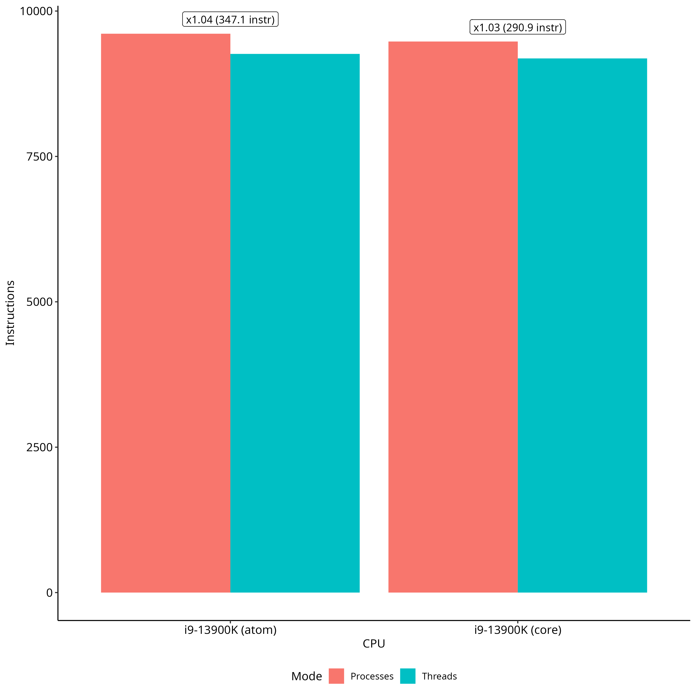
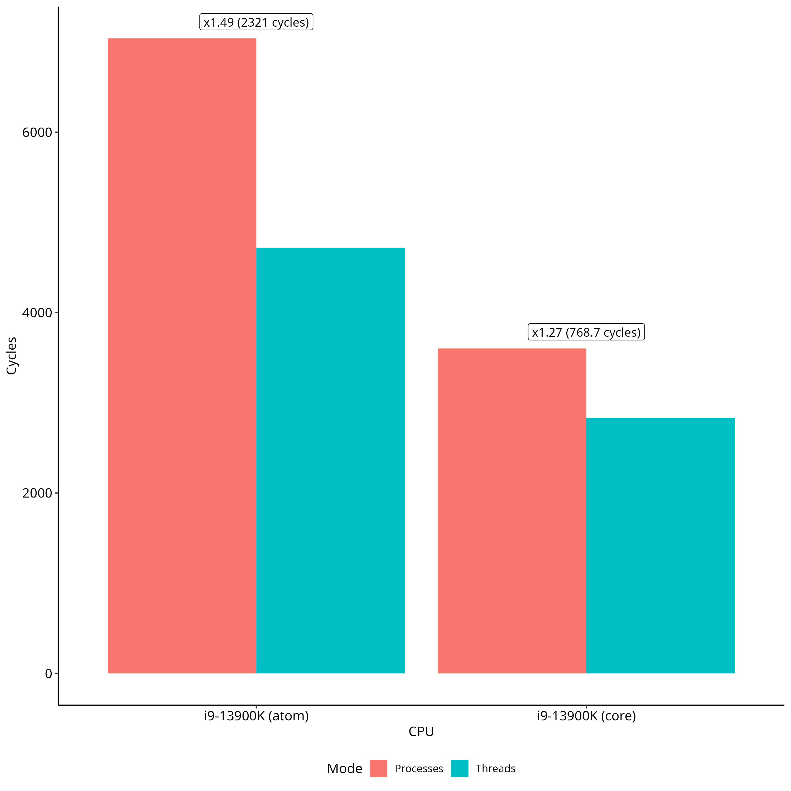

# Threads vs Processes

Is context switch between threads of the same process faster than context switch
between different processes? In other words, what is the cost of switching to
another address space?

I implemented a "hot potato" benchmark, similar to Lmbench's context switch
benchmark [1]. The benchmark creates a number of threads, each of which sends a
message to the next thread in the ring. The last thread sends the message back
to the first thread. The benchmark measures the time it takes for a message to
go around the ring.

I ran the benchmark with 400 threads/processes, each process doing 10000
iteratons. The system has i9-13900K CPU with big/little cores. So I measured
big and little cores separately. The benchmark was run on Linux 6.1.

## Results

First, let's look at the results measured in CPU reference cycles.

The whole context switch takes about 3000 to 7000 cycles. This includes the time
required to to read and write the pipe. The overhead added by having a separate
address space varies from 760 to 2300 cycles. The overhead is higher on the
little cores. This is expected, because the little cores are slower. In relative
terms, the overhead is about 30% on the big cores and 50% on the little cores.

Looking at the results in nanoseconds, the situation is very similar. We can see
that the overhead is about 50% on the little cores and about 30% on the big
ones. In absolute number in both cases the overhead is less than 1 microsecond:
260 ns on the big cores and 800 ns on the little cores.

Interestingly, the difference in instruction count is not proportional to the
difference in time. Instead, for both the cores the difference in the number of
instructions between threads and processes is very small. Only around 3%. This
means that the difference in time is mostly due to a few slow instructions,
cache, or TLB misses.

The raw results are in [log](log/cts.log) directory.

## TODO

Original Lmbench benchmark also measures the cost of sending a message to the
same process. This allows to factor out the cost of using the pipe. On the one
hand it allows to have more precise numbers for the context switch. On the other
hand, there is no really a faster way to switch from one task to another than
using a pipe. So the numbers for the same process would be nice to have, but are
not really necessary.

## References

[1]: https://www.usenix.org/legacy/publications/library/proceedings/sd96/full_papers/mcvoy.pdf